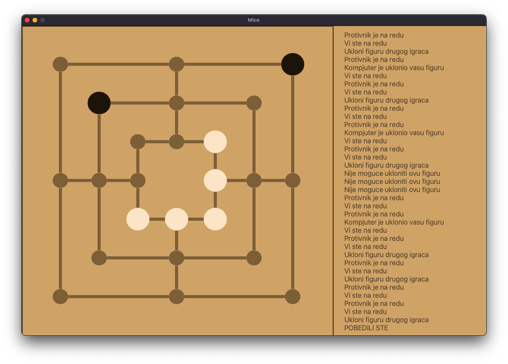

# Nine-mens-morris-ai

## Description of the Game
Nine Men's Morris is an ancient and strategic board game dating back to 1400 BC, with archaeological evidence suggesting its origins. Known also as Merrills or Mill, the game unfolds on a square board with intersecting lines, creating pivotal points.

The game begins with an empty board. Players take turns placing their pieces, often called "men," onto the board's spaces. The goal is to form "mills" by aligning three pieces along the lines, either vertically or horizontally. Creating a mill allows a player to remove one of their opponent's pieces, unless those pieces are part of mills themselves.

The game progresses until one player has only two pieces left, rendering them unable to form or block mills, resulting in their defeat. Alternatively, a player may lose if they cannot make a legal move. Rarely, the game ends in a draw if both players exhaust their options.

Nine Men's Morris requires strategic thinking and foresight, challenging players to anticipate their opponent's moves while planning their own. Its enduring popularity across diverse cultures underscores its timeless appeal.

## Implementation
This Python implementation of Nine Men's Morris features an AI player with a graphical user interface (GUI). The AI bot employs the Minimax algorithm with Alpha-Beta pruning to make strategic decisions during gameplay.

